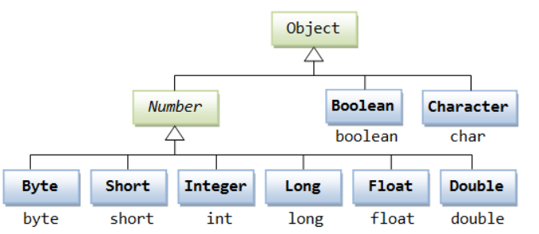

## 9.1 包装类Warpper

### 9.1.1 包装类介绍

针对八种基本数据类型相应的引用类型—包装类

有了类的特点，就可以调用类中的方法。

| 包装类    | 基本数据类型 |
| --------- | ------------ |
| Boolean   | boolean      |
| Byte      | byte         |
| Short     | short        |
| Integer   | int          |
| Long      | long         |
| Character | char         |
| Float     | float        |
| Double    | double       |

### 9.1.2 包装类和基本数据的转换

这种由编译器特别支持的包装称为装箱，所以当内置数据类型被当作对象使用的时候，编译器会把内置类型装箱为包装类。相似的，编译器也可以把一个对象拆箱为内置类型。

- jdk5前的手动装箱和拆箱方式,装箱:基本类型->包装类型,反之，拆箱
-  jdk5 以后(含jdk5)的自动装箱和拆箱方式
- 自动装箱底层调用的是valueOf方法，比如Integer.valueOf
- 其它包装类的用法类似,不一一举例

~~~java
public static void main(String[] args) {
	//手动装箱 int->Integer
	int n1 = 100;
	Integer integer = new Integer(n1);
	Integer integer1 = Integer.valueOf(n1);
    
	//手动拆箱 Integer -> int
	int i = integer.intValue();
    
    int n2 = 200;
    //jdk5 后，就可以自动装箱和自动拆箱
    //自动装箱int->Integer
	Integer integer2 = n2; //底层使用的是Integer.valueOf(n2)
	//自动拆箱Integer->int
	int n3 = integer2; //底层仍然使用的是intValue()方法
}
~~~

### 9.1.3 包装类型和String 类型的相互转换

~~~java
public static void main(String[] args) {
    //包装类(Integer)->String
    Integer i = 100;//自动装箱
    
    //方式1
    String str1 = i + "";
    
    //方式2
    String str2 = i.toString();
    
    //方式3
    String str3 = String.valueOf(i);
    
    //String -> 包装类(Integer)
    String str4 = "12345";
    Integer i2 = Integer.parseInt(str4);//使用到自动装箱
    Integer i3 = new Integer(str4);//构造器
}
~~~

### 9.1.4 Integer 类和Character 类的常用方法

~~~java
public static void main(String[] args) {
    System.out.println(Integer.MIN_VALUE); //返回最小值
    System.out.println(Integer.MAX_VALUE);//返回最大值
    System.out.println(Character.isDigit('a'));//判断是不是数字
    System.out.println(Character.isLetter('a'));//判断是不是字母
    System.out.println(Character.isUpperCase('a'));//判断是不是大写
    System.out.println(Character.isLowerCase('a'));//判断是不是小写
    System.out.println(Character.isWhitespace('a'));//判断是不是空格
    System.out.println(Character.toUpperCase('a'));//转成大写
    System.out.println(Character.toLowerCase('A'));//转成小写
}
~~~

