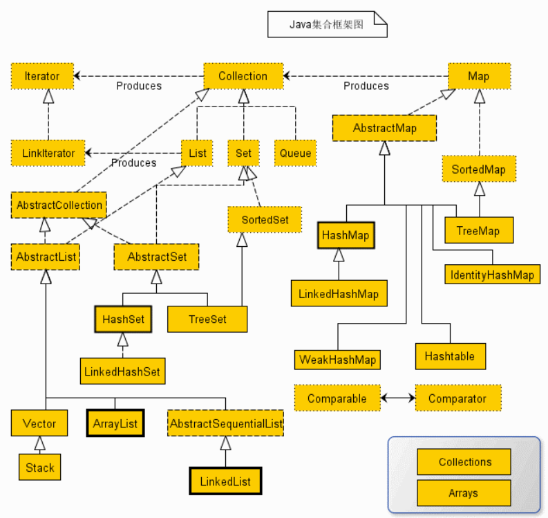

## 10.1 集合的框架体系

集合框架被设计成要满足以下几个目标。

- 该框架必须是高性能的。基本集合（动态数组，链表，树，哈希表）的实现也必须是高效的。
- 该框架允许不同类型的集合，以类似的方式工作，具有高度的互操作性。
- 对一个集合的扩展和适应必须是简单的。

从上面的集合框架图可以看到，Java  集合框架主要包括两种类型的容器，一种是集合（Collection），存储一个元素集合，另一种是图（Map），存储键/值对映射。Collection 接口又有 3 种子类型，List、Set 和 Queue，再下面是一些抽象类，最后是具体实现类，常用的有 ArrayList、LinkedList、HashSet、LinkedHashSet、HashMap、LinkedHashMap 等等。

~~~java
// 集合主要是两组(单列集合, 双列集合)
// Collection 接口有两个重要的子接口List Set , 他们的实现子类都是单列集合
// Map 接口的实现子类是双列集合，存放的K-V 类似Python的字典
ArrayList arrayList = new ArrayList();
arrayList.add("jack");
arrayList.add("tom");

HashMap hashMap = new HashMap();
hashMap.put("NO1", "北京");
hashMap.put("NO2", "上海");
~~~

