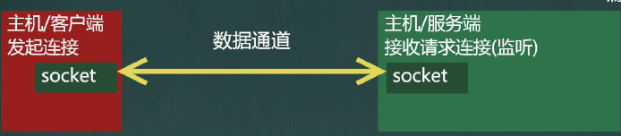

## 14.3 Socket

套接字(Socket)开发网络应用程序被广泛采用，以至于成为事实上的标准。通信的两端都要有Socket，是两台机器间通信的端点网络通信其实就是Socket间的通信。

Socket允许程序把网络连接当成一个流，数据在两个Socket间通过IO传输，一般主动发起通信的应用程序属客户端,等待通信请求的为服务端

当我们需要通讯时(读写数据)

- `socket.getOutputStream()`
- `socket.getInputStream()`

