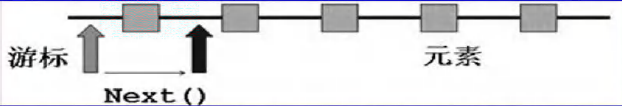

## 10.2 Collection 接口和常用方法

### 10.2.1 Collection 接口实现类的特点

- collection实现子类可以存放多个元素，每个元素可以是Object
- 有些Collection的实现类，可以存放重复的元素，有些不可以
- 有些collection的实现类，有些是有序的(List)，有些不是有序(Set)
- Collection接口没有直接的实现子类，是通过它的子接口Set 和 List来实现的

Collection 接口常用方法

~~~java
List list = new ArrayList();
// add:添加单个元素
list.add("jack");
list.add(10);
list.add(true);

// remove:删除指定元素
list.remove(0);//删除第一个元素
list.remove(true);//指定删除某个元素

// contains:查找元素是否存在
System.out.println(list.contains("jack"));

// size:获取元素个数
System.out.println(list.size());

// isEmpty:判断是否为空
System.out.println(list.isEmpty());

// clear:清空
list.clear();

// addAll:添加多个元素
ArrayList list2 = new ArrayList();
list2.add("红楼梦");
list2.add("三国演义");
list.addAll(list2);

// containsAll:查找多个元素是否都存在
System.out.println(list.containsAll(list2));

// removeAll：删除多个元素
list.removeAll(list2);
~~~

### 10.2.2 Collection 接口遍历元素方式

##### 10.2.2.1 使用Iterator(迭代器)

1) lterator对象称为迭代器，主要用于遍历Collection 集合中的元素。
2) 所有实现了Collection接口的集合类都有一个iterator()方法,用以返回一个实现了Iterator接口的对象,即可以返回一个迭代器。
4) lterator仅用于遍历集合,Iterator本身并不存放对象。

~~~java
ArrayList<String> sites = new ArrayList<String>();
sites.add("Google");
sites.add("Taobao");
sites.add("Zhihu");

// 获取迭代器
Iterator<String> it = sites.iterator();

// 输出集合中的所有元素
while(it.hasNext()) {
    System.out.println(it.next());
}
~~~

- `hasNext()`如果还有更多的元素，则返回True
- `next()`指针下移，并返回所指的元素

>- 在调用`iterator.next()`方法之前必须要调用`iterator.hasNext()`进行检测。若不调用，且下一条记录无效，直接调用`it.next()`会抛出`NoSuchElementException`异常。
>- 当退出while 循环后, 这时iterator 迭代器，指向最后的元素,如果希望再次遍历，需要重置我们的迭代器

##### 10.2.2.2 for 循环增强

增强for循环,可以代替iterator迭代器，特点:增强for就是简化版的iterator,本质一样。只能用于遍历集合或数组。

~~~java
for(元素类型 元素名: 集合名或数组名){
    访问元素
}
~~~

例如

~~~java
List list = new ArrayList();
list.add(new Dog("小黑", 3));
list.add(new Dog("大黄", 100));
list.add(new Dog("大壮", 8));
for (Object dog : list) {
	System.out.println("dog=" + dog);
}
~~~

