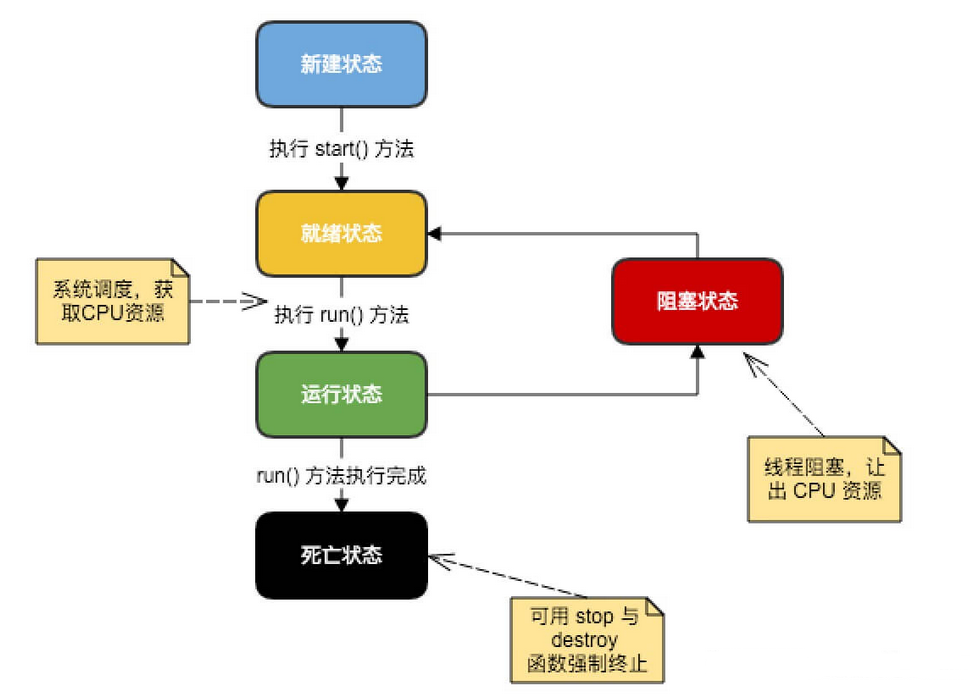

## 12.1 创建线程的方式-继承Thread类

创建一个线程的第一种方法是创建一个新的类，该类继承 Thread 类，然后创建一个该类的实例。

继承类必须重写 run() 方法，该方法是新线程的入口点。它也必须调用 start() 方法才能执行。

该方法尽管被列为一种多线程实现方式，但是本质上也是实现了 Runnable 接口的一个实例。

```java
public class thread_ {

    public static void main(String[] args) {
        Runtime runtime = Runtime.getRuntime();
        int cpuNums = runtime.availableProcessors();
        System.out.println(cpuNums); // 8核CPU

        Cat cat = new Cat("oamfoawmw");
        cat.start();

    }
}

class Cat extends Thread{
    private int times = 0;
    String s;

    public Cat(String s){
        this.s = s;
    }

    @Override
    public void run() {
        System.out.println(s);
        do {
            System.out.println("cat~ cat~" + (++times));
            try {
                Thread.sleep(1000);
            } catch (InterruptedException e) {
                e.printStackTrace();
            }
        } while (times != 10);
    }
}
```



start()方法调用start0()方法后，该线程并不一定会立马执行，只是将线程变成了可运行状态。具体什么时候执行，取决于CPU，由CPU统一调度。