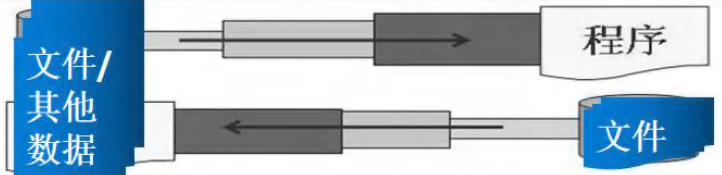
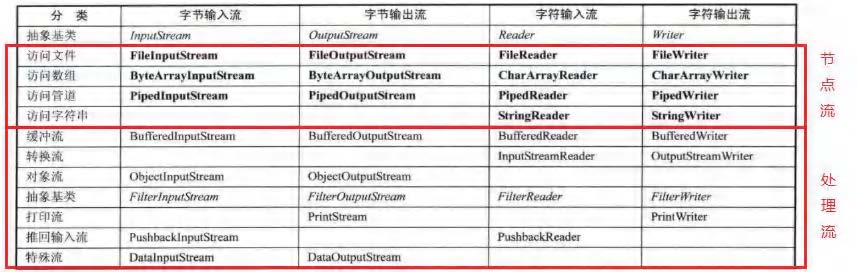

## 13.6 节点流和处理流

- 节点流可以从一个特点的数据源读取数据，如FileReader、FileWriter

- 处理流（也叫包装流）是链接在已存在的流（节点流或处理流）之上，为程序提供更为强大的读写功能，也更加灵活。如BufferedReader、BufferedWriter
  - 性能的提高:主要以增加缓冲的方式来提高输入输出的效率。
  - 操作的便捷:处理流可能提供了一系列便捷的方法来一次输入输出大批量的数据,使用更加灵活方便

- 节点流是底层流/低级流,直接跟数据源相接。
- 处理流(包装流)包装节点流，既可以消除不同节点流的实现差异，也可以提供更方便的方法来完成输入输出。
- 处理流(也叫包装流)对节点流进行包装，使用了修饰器设计模式，不会直接与数据源相连