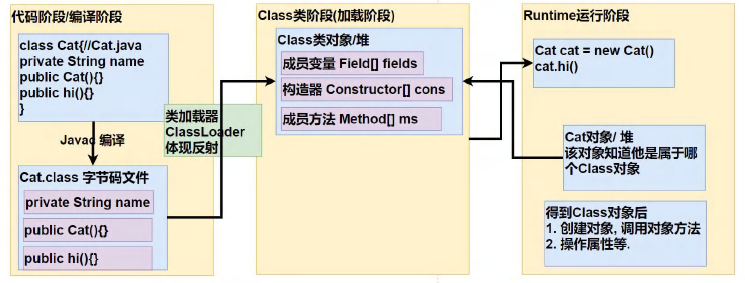

## 15.1 反射引入

- 反射机制允许程序在执行期借助于Reflection
  API取得任何类的内部信息(比如成员变量，构造器，成员方法等等)，并能操作对象的属性及方法。反射在设计模式和框架底层都会用到
- 加载完类之后,在堆中就产生了一个Class类型的对象(一个类只有一个Class对象)，这个对象包含了类的完整结构信息。通过这个对象得到类的结构。这个Class对象就像一面镜子，透过这个镜子看到类的结构，所以,形象的称之为:反射

```java
public class ReflectionQuestion {
    public static void main(String[] args) throws IOException, ClassNotFoundException, InstantiationException, IllegalAccessException, NoSuchMethodException, InvocationTargetException {
        /* 传统方法
         Cat cat = new Cat();
         cat.hi();
         */
        Properties properties = new Properties();
        properties.load(new FileInputStream(".\\re.properties"));
        String classfullpath = properties.get("classfullpath").toString();
        String method = properties.get("method").toString();
        System.out.println(classfullpath + method);
        // 加载类，返回Class类型的对象
        Class<?> aClass = Class.forName(classfullpath);
        // 得到类的运行对象实例
        Object o = aClass.newInstance();
        // 得到方法对象
        Method method1 = aClass.getMethod(method);
        // 通过method1调用方法
        method1.invoke(o);
    }
}
```



反射机制可以

- 在运行时判断任意一个对象所属的类
- 在运行时构造任意一个类的对象
- 在运行时得到任意一个类所具有的成员变量和方法
- 在运行时调用任意一个对象的成员变量和方法
- 生成动态代理

> 优点:可以动态的创建和使用对象(也是框架底层核心).使用灵活,没有反射机制,框架技术就失去底层支撑。
>
> 缺点:使用反射基本是解释执行,对执行速度有影响.